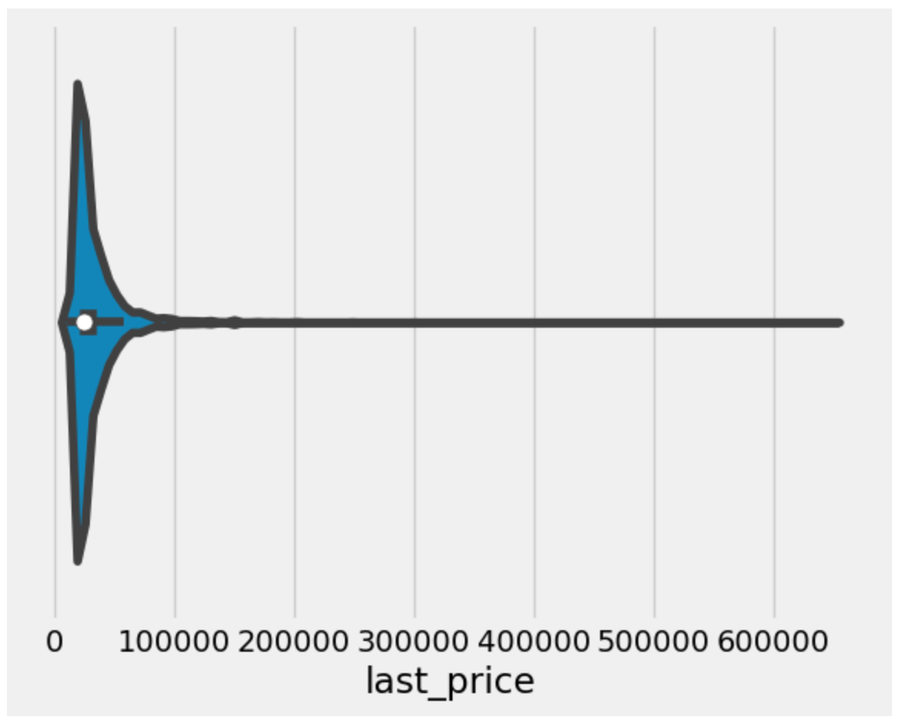
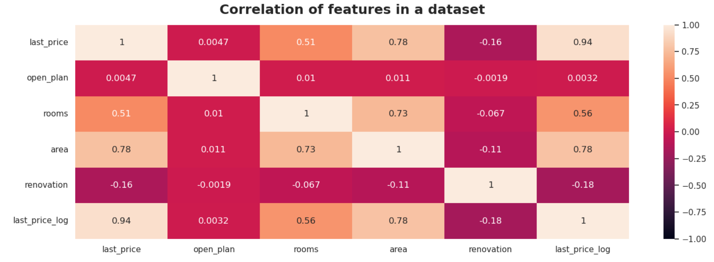
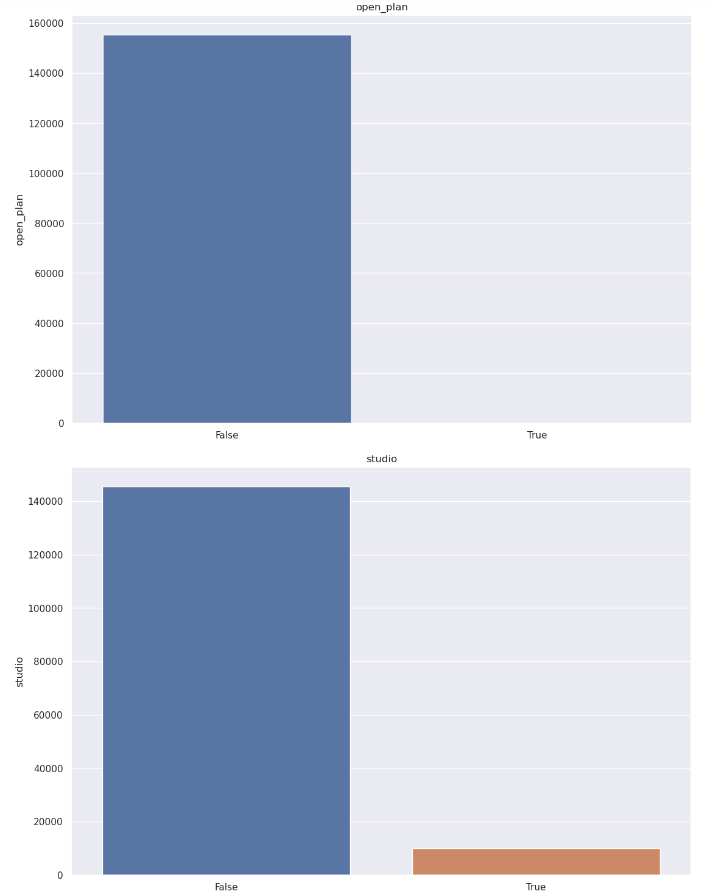

# Project report: Real estate price prediction

## Project overview

The project aims to **create a predictive model for estimating rental flat values based on historical data**, encompassing past flat prices and their specifications.

The **Yandex.Realty dataset**, includes real estate listings for apartments in St. Petersburg and Leningrad Oblast spanning **from 2016 to 2018:**

1. **Last Price:** The most recent price at which the property was listed or sold
2. **Floor:** The floor number on which the property is located
3. **Rooms:** The number of rooms available in the property
4. **Area:** The total area or size of the property
5. **Kitchen Area:** The area specifically designated for the kitchen within the property
6. **Living Area:** The area intended for living spaces such as the living room, bedrooms, etc
7. **Agent Fee:** The fee charged by the agent or agency involved in the property transaction
8. **Renovation:** Indicates whether the property has undergone any recent renovations or improvements
9. **Building ID:** An identifier associated with the specific building or property

## Preprocessing

To further work with the dataset, it was necessary to deal with missing values, get rid of outliers and prepare the dataset for building a model, selecting the most significant features and paying special attention to the target variable







## Model Creation

**Features:** open_plan, rooms, area, renovation

**Target variable:** last_price

The data set was divided into training and test.

The models were developed using the scikit-learn framework.

As part of the project, 3 models were developed: Decision Tree model, Random forest and Gradient boosting.

The best results in terms of learning speed and metrics were demonstrated by the **Gradient boosting model**, which was later used on the test sample.

The effectiveness of the models was assessed using three metrics:

- **MAE:** 0.35952524012846615
- **MSE:** 0.34581558655370054
- **RMSE:** 0.5880608697691937

## Virtual environment

We need to activate virtual environment:

```python
python3 -m venv env
source env/bin/activate 
```
Save all the requirement into the special file:

```python
pip install -r requirements.txt
```
Run the app:

```python
python app.py
```

## Docker

We need to create a dockerfile using:

```python
FROM ubuntu:20.04
MAINTAINER Anna Uskova
RUN apt-get update -y
COPY . /opt/gsom_predictor
WORKDIR /opt/gsom_predictor
RUN apt install -y python3-pip
RUN pip3 install -r requirements.txt
CMD python3 app.py
```

And run our app using:

```python
docker run --network host -d annauskova/gsom_e2e24:v.0.1
sudo ufw allow 7778
python app.py
```


